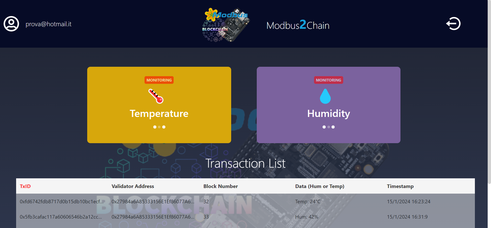
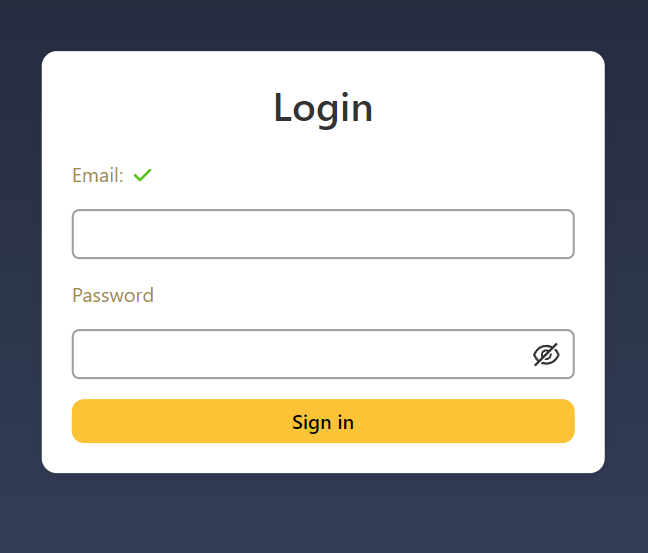
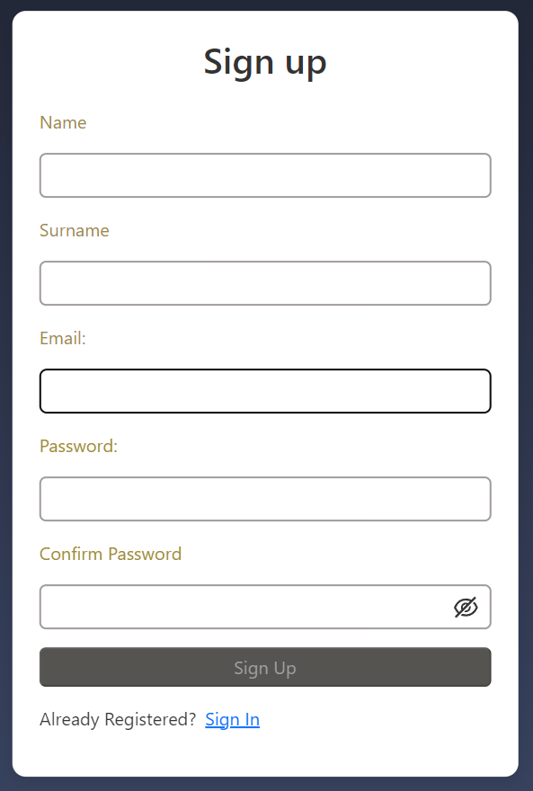

# Modbus2Chain Front-End Application

Welcome to the `Modbus2Chain` Front-End application! This simple interface aims to make all the functions implemented by the Back-End of the application accessible in a user-friendly manner, from the visualization of the data taken from the IoT devices, up to the notarization of the data on the blockchain.

⬇️Below is a screen of the application dashboard that will be shown⬇️.

## Features

- **User Authentication**: The application employs JWT (JSON Web Tokens) to provide secure login and signup functionality to access.

⬇️Below is a screen of a screen of the Login form⬇️.
<picture>
  <source srcset="./readme_assets/LoginPage.png">
  
</picture>

Once logged into the application, the system will check whether the logged in user is part of a `Hyperledger Fabric` network organization and has the appropriate permissions to operate on the network. If so, the user will be able to notarize and view the transaction list, otherwise, he will only be able to view the temperature and humidity data provided by the detection sensors

⬇️Below is a screen of a screen of the Registration form⬇️.
<picture>
  <source srcset="./readme_assets/RegistrationPage.png" >
  
</picture>

User registration allows you to save the data entered within `MongoDB`, the database used by Modbus2Chain for saving user data and for the correct organization of the set of transactions carried out, thus helping to speed up the process of data visualization, avoiding continuously querying the blockchain.

- **Data Monitoring**: Near real-time monitoring of humidity and temperature detected by sensors.

- **Transaction List**: View a detailed list of all transactions, including validator addresses, block numbers, data, and timestamps.

The list of transactions displayed corresponds to all blockchain notarizations carried out by authorized users.

## Getting Started

Follow these instructions to set up your local development environment:

1. If you have already cloned the repository, switch to the MC_FE branch
2. Install dependencies with `npm install`.

## Start the Application

- `npm start`: Runs the app at [https://localhost:3000](https://localhost:3000).

The following project has been set up to work on **HTTPS** communication with self-signed certificates for testing and study purposes only. Obviously it is not a configuration to be used in production environments.

You will need to create your own self-signed certificates or use valid certificates. These must be set for both the middleware and the React application.