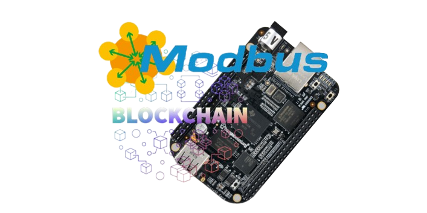

# Modbus2Chain

Modbus2Chain è un progetto IoT che utilizza il protocollo Modbus per acquisire dati ambientali e li invia in modo sicuro alla blockchain attraverso una connessione seriale. L'obiettivo è quello di creare un sistema efficiente per la raccolta e la condivisione di dati ambientali critici e di tenere traccia di essi attraverso la blockchain.
