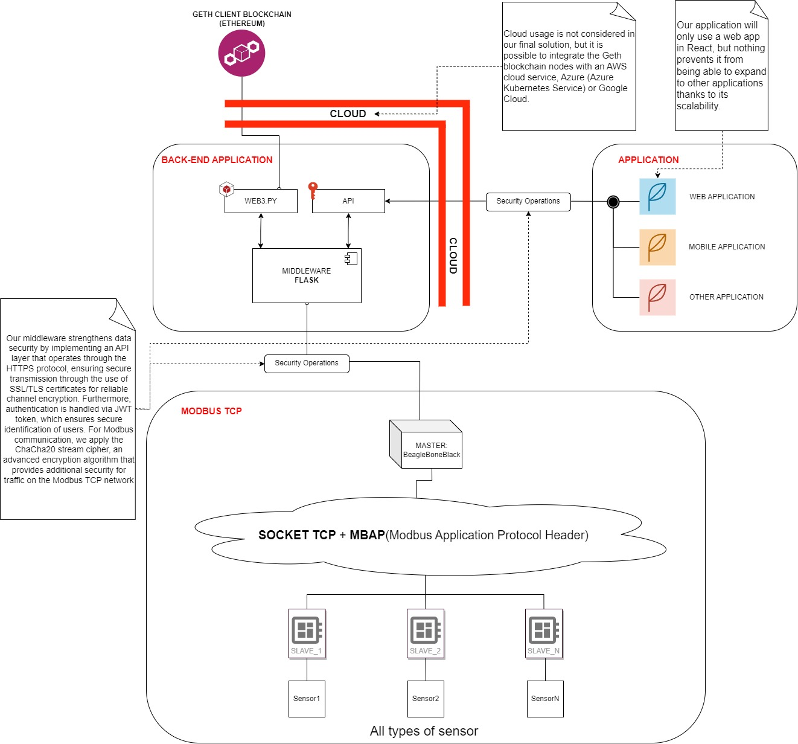

# Modbus2Chain
<picture>
  <source srcset="./app/assets/LogoProgetto.png" media="(min-width: 680px)">
  
</picture>

Table of contens
=============

* [Description](#description)
* [Installation](#installation)
  * [Back_End_Application](#back_end_application)
  * [Blockchain_Application](#blockchain_application)
  * [React_Application](#react_application)

Description
--------

**Modbus2Chain** is an IoT project that uses the Modbus protocol to acquire environmental data from sensors and send it securely to the blockchain via an `RS-485` serial connection. This choice was made because `RS-485` is a long distance serial protocol that allows reliable communication between devices in noisy industrial environments.

To achieve the goal of creating an efficient system for collecting and sharing critical environmental data, the project uses a number of technologies:
 
 - The Modbus protocol back-end and device management is implemented in `Python`, using the `PyModbus` library for communication with sensors.
 - The blockchain that is used is `Hyperledger Fabric`, a framework for creating highly scalable and modular enterprise blockchains. Hyperledger Fabric provides a secure and reliable platform for logging and sharing critical data, enabling easy permission management and enhanced data privacy.
 - The user interface is developed in `React`, a JavaScript framework for creating responsive and dynamic user interfaces. 

The system workflow begins with the collection of environmental data from sensors using the Modbus protocol over `RS-485`. The acquired data is then sent to the Python back-end, which processes it and sends it to the `Hyperledger Fabric` blockchain using the APIs made available by the framework. The blockchain guarantees the integrity and immutability of data, which can be easily shared with other authorized users.

⬇️Below, a graphic diagram of the workflow in order to make it easier to understand and interact between the different components of the system⬇️.

<picture>
  <source srcset="./app/assets/ArchitectureDiagram.jpg" media="(min-width: 680px)">
  
</picture>

Thanks to **Modbus2Chain**, it is possible to create an efficient system for collecting and sharing critical environmental data, guaranteeing their security and integrity through the `Hyperledger Fabric` blockchain. Furthermore, thanks to the use of modern technologies such as `React` and `Python`, the project is highly flexible and easily scalable to meet the needs of any IoT application.

Installation
--------
Insert general installation part
### Back_End_Application
Insert backend installation part
### Blockchain_Application
Insert blockchain installation part
### React_Application
Insert React installation part

