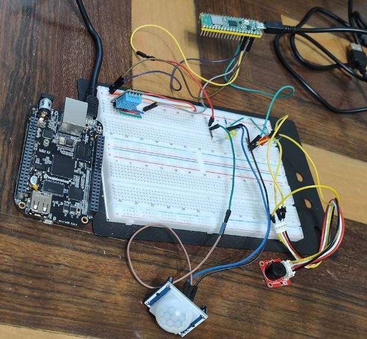

# Modbus2Chain
<picture>
  <source srcset="./app/assets/LogoProgetto.png" media="(min-width: 680px)">
  
</picture>

Table of contens
=============

* [Description](#description)
* [Installation](#installation)
* [IoT_Architecture](#iot_architecture)
  * [Back_End_And_Blockchain_Application](#back_end_and_blockchain_application)
  * [React_Application](#react_application)
* [Presentation](#presentation)
* [Conclusions](#conclusions)
* [Sources](#sources)

Description
--------

**Modbus2Chain** is an IoT project that uses the Modbus protocol to acquire environmental data from sensors and send it securely to the blockchain via a `TCP` connection. This choice was made because `Modbus TCP` is very popular for implementing IoT communications in industrial environments, due to its wide adoption, compatibility with Ethernet networks, adequate security and real-time communication capabilities

To achieve the goal of creating an efficient system for collecting and sharing critical environmental data, the project uses a number of technologies:
 
 - The Modbus protocol back-end and device management is implemented in `Python`, using the `micropython-modbus` library for communication with sensors.
 - The blockchain that is used is `Geth`, a Go implementation of the Ethereum protocol. Geth is an Ethereum execution client meaning it handles transactions, deployment and execution of smart contracts and contains an embedded computer known as the Ethereum Virtual Machine.
 - The user interface is developed in `React`, a JavaScript framework for creating responsive and dynamic user interfaces. 

The system workflow begins with the collection of environmental data from sensors using the Modbus TCP protocol. The acquired data is then sent to the Python back-end, which processes it and sends it to the `Geth` blockchain using the `web3.py` library. The blockchain guarantees the integrity and immutability of data, which can be easily shared with other authorized users.

⬇️Below, a graphic diagram of the workflow in order to make it easier to understand and interact between the different components of the system⬇️.

<picture>
  <source srcset="./app/assets/ArchitectureDiagram.png" media="(min-width: 680px)">
  
</picture>

Thanks to **Modbus2Chain**, it is possible to create an efficient system for collecting and sharing critical environmental data, guaranteeing their security and integrity through the `Geth` blockchain. Furthermore, thanks to the use of modern technologies such as `React` and `Python`, the project is highly flexible and easily scalable to meet the needs of any IoT application.

IoT_Architecture
--------
Being an exam project, for pure study purposes, very simple and easily configurable **IoT devices** were used, connected to each other on a breadboard.

The IoT devices are also connected to a `slave` device (MCU) (in our case a `Raspberry Pi Pico W`), which allows us to manage the `Modbus TCP` requests arriving from our master (a `BeagleBone Black`) and save the data on Modbus registers (`HREGS` Holding Registers and `COILS` registers were used in our project).
For more details on Modbus registers you can consult this simple guide: [Modbus_Registers](https://csimn.com/MHelp-VP3-TM/vp3-tm-appendix-C.html#:~:text=Modbus%20Register%20Types&text=Coils%20are%201%2Dbit%20registers,and%20may%20only%20be%20read.)

⬇️Below is a photo of the connections made⬇️.
<picture>
  <source srcset="./app/assets/IoTArchitecture.jpeg" media="(min-width: 680px)">
  
</picture>

If the temperature exceeds a certain threshold, the buzzer (`Crowtail Buzzer 2.0`) sounds intermittently for a certain period, lighting up the red LED simulating an alarm.
If movement is detected through the sensor (`HC-SR501 PIR`), the yellow LED lights up and it is possible, through other configurations present, to ensure that at the moment of a detection, the buzzer sounds, simulating another type of alarm, based on the movement, in fact.

The temperature and humidity sensor (`DHT11`), however, is always active, continuously monitoring temperature and humidity, whose values are saved in the registers (or notarized if the user chooses to do so, on the blockchain).

Temperature and humidity data are assumed as **hypothetical critical data** to be made immutable on the blockchain and to be monitored continuously.

Installation
--------
For the correct functioning of the application, READMEs are linked below to the respective sections. Read all the READMEs carefully to avoid making configuration errors.

### Back_End_And_Blockchain_Application
For detailed instructions on setting up and using the Back-End and the Blockchain network of this application, please refer to the [Back-End & Blockchain README](./README_BE_BC.md).
### React_Application
For detailed instructions on setting up and using the Front-End of this application, please refer to the [Front-End README](https://github.com/Alessandro-Cavaliere/Modbus2ChainETH/blob/MC_FE/README.md).

Presentation
--------

For this project, a summary `presentation` was also created of what this project is about, what technologies were used, the security criteria and more.

To view the presentation pdf (in Italian) download it directly from here ➡️ [Presentation](./Modbus2chain_Presentation.pdf)

Conclusions
--------

As already mentioned, this project was developed purely for study purposes for the exams of the IoT Security and Data Security course. The following project does not have a real application function in corporate or industrial contexts, the study which was carried out and demonstrated aims to develop software that combines two very important technologies (blockchain and IoT) and uses cutting-edge security criteria for the security of a hypothetical application that handles sensitive data and critical information.

Furthermore, a new communication for us (Modbus) was tested, which allowed us to understand its mechanisms and critical issues. We decided to use Modbus because it is the standard for industrial communication protocols, mainly used in industrial automation to connect programmable logic controllers (PLCs).

Sources
--------
- [Modbus Definition](https://en.wikipedia.org/wiki/Modbus)
- [Modbus Registers - 1](https://csimn.com/MHelp-VP3-TM/vp3-tm-appendix-C.html)
- [Modbus Registers - 2](https://www.fernhillsoftware.com/help/drivers/modbus/modbus-protocol.html)
- [Modbus TCP Overview](https://www.rtautomation.com/technologies/modbus-tcpip/)
- [MicroPython Overview](https://micropython.org/)
- [MicroPython Modbus Library](https://github.com/brainelectronics/micropython-modbus)
- [Beaglebone Black Docs](https://docs.beagleboard.org/latest/index.html)
- [Raspberry Pi Pico Docs](https://www.raspberrypi.com/documentation/microcontrollers/raspberry-pi-pico.html)
- [Geth Overview](https://geth.ethereum.org/docs/getting-started)
- [Geth Download](https://geth.ethereum.org/downloads)
- [Geth Clique PoA Network](https://geth.ethereum.org/docs/tools/clef/clique-signing)
- [Geth Command Options](https://geth.ethereum.org/docs/fundamentals/command-line-options)
- [Private Network Docs](https://geth.ethereum.org/docs/fundamentals/private-network)
- [Web3.py library](https://web3py.readthedocs.io/en/stable/)
- [OpenSSL Download](https://www.openssl.org/source/)
- [Flask User Guide](https://flask.palletsprojects.com/en/3.0.x/)
- [React User Guide](https://react.dev/learn)

